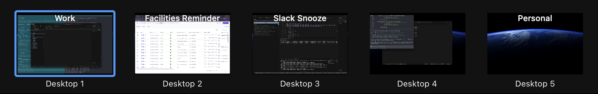
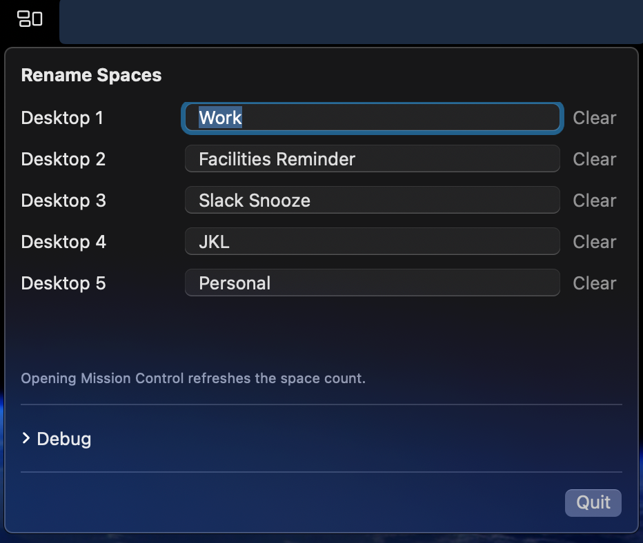

# Rename Spaces

Rename Spaces is a macOS menu bar app that overlays custom Space names in Mission Control.

## Screenshot

#### Mission Control


#### Menu


## Install (curl)

```bash
curl -fsSL "https://raw.githubusercontent.com/egwoo/rename-spaces/main/scripts/install.sh?$(date +%s)" | bash -s -- --yes
```

Notes:
- This pulls the latest GitHub Release and expects a `Rename Spaces.zip` asset.
- The app is not signed/notarized, so Gatekeeper may warn. The script attempts to remove quarantine.

## Build

```bash
./scripts/build_app.sh
```

This creates `dist/Rename Spaces.app`.

## Run from source

```bash
swift run SpacesRenamerApp
```

## Permissions

The overlay requires Accessibility access:
- System Settings -> Privacy & Security -> Accessibility
- Enable Rename Spaces

## How it works

The app stores custom names by space ID and keeps them in the same order as the desktops listed
in `com.apple.spaces`, so renames follow when you reorder spaces. On macOS 14.6.1, the Dock
accessibility tree does not always expose the "Desktop N" labels, so the overlay uses a heuristic
layout (evenly spaced labels near the top) instead of exact label frames when needed.

## Limitations

- This does not rename Spaces at the system level. It is a visual overlay only.
- The overlay is heuristic and may be slightly misaligned on some setups.
- Parsing is currently English-only ("Desktop N"/"Space N").

## Manual tests

1. Build and launch the app.
2. Accept the Accessibility prompt.
3. Set a custom name for Desktop 1.
4. Open Mission Control and confirm the label is replaced.
5. Clear the custom name and confirm the default label shows.
6. Add/remove Spaces and open Mission Control; confirm the space count refreshes.
